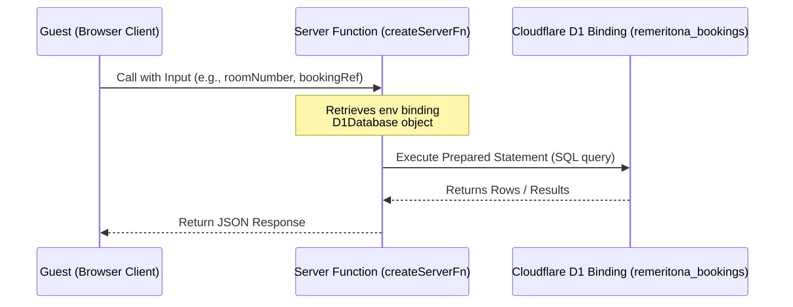

# Remeritona Luxury Digital — Lexgold Engineering Blueprint

This document provides a comprehensive master overview of the **Remeritona Luxury Digital** system. It outlines the client routes, payment structures, database configurations, and a directory layout freeze-frame.

---

## 1. UI Route and Page Architecture

The user interface is powered by **TanStack Router / TanStack Start**, generating a clean single-page app structure with server-side API endpoints. Below is a breakdown of every active route in the application:

### Client-Side Routes (`src/routes/`)
*   **Root Layout (`__root.tsx`)**: The global template containing base HTML, stylesheet imports (Montserrat, Merriweather, custom `styles.css`), Google Translate integration script (en, ig, yo, ha, fr, es, it), and the floating WhatsApp Chat Button widget (hidden on admin dashboards). Also dynamically embeds the Paystack Inline SDK script.
*   **Home / Landing (`index.tsx`)**: Entry point of the web app featuring visual headers, marketing content, luxury hotel amenities, and the main booking widgets.
*   **Rooms Directory (`rooms.tsx`)**: Displays all room categories, amenities, capacities, and pricing models.
*   **Room Detail (`rooms.$slug.tsx`)**: Dynamic route showcasing individual room details, gallery, and configurations.
*   **Guest Booking Engine (`booking.tsx`)**: A multi-step stepper form (`1. Dates & Guests`, `2. Guest Details`, `3. Payment choice`) facilitating room reservations. Features live availability capacity checks, addon selections, coupon/discount code applications, and client-side inline checkouts via Paystack and Flutterwave.
*   **Guest Hub Portal (`my-bookings.tsx`)**: Accessible to active guests using a room number and booking reference. Enables invoice inspection, DND toggling, chat support, service request creation, in-room food/beverage dining orders, spa booking scheduling, and cancellation/refunding requests.
*   **Property Management System Dashboard (`hotel-admin.tsx`)**: Property Management System (PMS) panel for receptionists, accountants, and administrators. Supports check-ins, check-outs, housekeeping status updates, staff registration, real-time guest request lists, invoice creation, and revenue report compiling.
*   **Chat Management Dashboard (`chat-management.tsx`)**: Console for front-desk/concierge operators to manage live real-time conversations with in-house guests, read/delete message threads, and reply to guests.
*   **Static Marketing & Support pages**:
    *   `about.tsx` (About Us)
    *   `contact.tsx` (Direct Contact Form)
    *   `dining.tsx` (Dining Options / Restaurant Menu)
    *   `gallery.tsx` (Photo/Video Gallery Showcase)
    *   `offers.tsx` (Special Promotions & Packages)
    *   `policies.tsx` (Hotel Terms, Rules, and Policies)
*   **Sub-dashboard Route Wrappers**:
    *   `menu-management.tsx`
    *   `orders-requests.tsx`
    *   `spa-management.tsx`

### Server-Side API Routes (`src/routes/api/`)
*   `/api/bookings-active-count`: Returns active confirmed booking counts to the admin panel.
*   `/api/bookings-recent`: Fetches recent bookings for real-time notification alerts.
*   `/api/guest-requests.$id.status`: Handles status updates of custom guest requests (e.g. pending to completed).
*   `/api/menu-items` & `/api/menu-items.$id`: Handlers to fetch, add, update, or remove restaurant menu offerings.
*   `/api/messages.conversation` / `conversations` / `mark-read` / `message` / `reply` / `thread`: Powers real-time live support messaging threads.
*   `/api/new-bookings-count`: Polls counts of new reservations for reception desk notifications.
*   `/api/orders-and-requests`: Retrieves service and dining orders for the kitchen/staff dashboard queues.
*   `/api/room-orders.$id.status`: Handles status updates of dining orders.
*   `/api/save-booking`: Saves guest booking records.
*   `/api/spa-bookings` & `spa-bookings.$id.status`: Manages spa appointments and statuses.
*   `/api/sync-reservations`: Endpoint to synchronize internal reservation records.

---

## 2. Local Payment Gateway Integration Structure

The application features dual payment gateways integrated locally, supporting direct checkout and card tokenization for late charging.

### Configuration Public Keys
*   **Paystack Public Key**: `pk_test_a0160de54fc2cf9d624ee9b9451dbe1c8c96f52b`
*   **Flutterwave Public Key**: `FLWPUBK_TEST-c7659059ed4e5f5f6aa1fbb96055e919-X`

### Checkout Modes
1.  **Pay Now (Full Amount Checkout)**:
    *   **Paystack**: Loads `https://js.paystack.co/v1/inline.js` dynamically. It launches `window.PaystackPop.setup({...})` with the guest's email, amount (converted to Kobo), name, and phone. Upon success callback, it writes the booking record to the D1 database.
    *   **Flutterwave**: Loads `https://checkout.flutterwave.com/v3.js` dynamically. Launches `window.FlutterwaveCheckout({...})`. On completion, it triggers database writes and welcome emails.
2.  **Pay Later (Card Tokenization)**:
    *   For stays booked more than 72 hours in advance, guests can guarantee their booking by saving their card.
    *   Charges a non-refundable **₦100 tokenization fee**.
    *   Saves the resulting transaction reference/authorization token (`authCode`).
    *   The remaining booking balance is stored as a pending balance and automatically scheduled to charge the tokenized card 24 hours prior to the check-in date.

### Server-Side Refunds (`src/functions/cancelBooking.ts`)
*   Integrates Cloudflare Workers env keys: `PAYSTACK_SECRET_KEY` and `FLUTTERWAVE_SECRET_KEY`.
*   Checks reservation details. Based on cancel timing, calculates refund rates (e.g. 50% or 100% depending on policies).
*   **Paystack Refund**: POSTs to `https://api.paystack.co/refund` with headers `Authorization: Bearer ${cfEnv.PAYSTACK_SECRET_KEY}`.
*   **Flutterwave Refund**: POSTs to `https://api.flutterwave.com/v3/transactions/${ref}/refund` with headers `Authorization: Bearer ${cfEnv.FLUTTERWAVE_SECRET_KEY}`.

---

## 3. Cloudflare D1 Database & Guest Portal Interactions

The Guest Hub utilizes TanStack Start's `createServerFn` to execute server-side database tasks on a **Cloudflare D1 SQL database**.



### Key Database Tables
*   `guests`: Stores registered guests, check-in details, and loyalty rewards tier info.
*   `bookings`: Tracks reservations, payment mode, check-in receptionist, totals, status (`confirmed`, `checked_in`, `checked_out`, `cancelled`, `scheduled`).
*   `room_status`: Manages room assignments, current states (`vacant_clean`, `vacant_dirty`, `occupied`, `maintenance`, `reserved`), and floor levels.
*   `service_requests`: Houses custom guest requests (towels, maintenance, housekeeping).
*   `food_orders`: Kitchen queues for in-room dining orders.
*   `spa_bookings`: Bookings for spa massages and services.
*   `messages`: Log of Real-time support messages between guests and concierge staff.
*   `invoices`: Invoiced items linked to a room number.
*   `loyalty_redemptions`: Points redeemed for hotel benefits/rewards.

### Loyalty Program Calculations
Loyalty points are awarded when guests checkout or make orders:
*   Points formula: `Math.floor((Naira Spent / 1000) * Tier Multiplier)`
*   Multiplier mapping based on member status:
    *   **Tier 1**: 1.0x
    *   **Tier 2**: 1.5x
    *   **Tier 3**: 2.0x
    *   **Tier 4**: 2.5x
    *   **Tier 5**: 3.0x

---

## 4. Active System Layout Freeze-Frame

```text
remeritona-luxury-digital/
├── .tanstack/
├── .wrangler/
├── public/
├── src/
│   ├── assets/
│   │   └── logo.png
│   ├── components/
│   │   ├── ui/
│   │   ├── BookingEmail.tsx
│   │   ├── BookingWidget.tsx
│   │   ├── FloatingChatWidget.tsx
│   │   ├── IntroAnimation.tsx
│   │   ├── LanguageSwitcher.tsx
│   │   ├── MenuManagementView.tsx
│   │   ├── OrdersRequestsView.tsx
│   │   ├── SiteFooter.tsx
│   │   ├── SiteHeader.tsx
│   │   ├── SpaManagementView.tsx
│   │   └── WhatsAppButton.tsx
│   ├── contexts/
│   ├── data/
│   │   ├── bookings-store.ts
│   │   └── rooms.ts
│   ├── functions/
│   │   ├── adminAuth.ts
│   │   ├── cancelBooking.ts
│   │   ├── guestPortal.ts
│   │   ├── portal.functions.ts
│   │   ├── saveBookingToDb.ts
│   │   ├── saveRegistration.ts
│   │   ├── sendBookingEmail.ts
│   │   └── testDb.ts
│   ├── hooks/
│   ├── lib/
│   │   ├── menu-api-client.ts
│   │   ├── menu-seed.ts
│   │   ├── messages-api-client.ts
│   │   ├── orders-api-client.ts
│   │   ├── orders-helpers.ts
│   │   ├── pms-api.ts
│   │   ├── spa-api-client.ts
│   │   ├── spa-helpers.ts
│   │   └── utils.ts
│   ├── routes/
│   │   ├── api/
│   │   │   ├── bookings-active-count.ts
│   │   │   ├── bookings-recent.ts
│   │   │   ├── guest-requests.$id.status.ts
│   │   │   ├── menu-items.$id.ts
│   │   │   ├── menu-items.ts
│   │   │   ├── messages.conversation.ts
│   │   │   ├── messages.conversations.ts
│   │   │   ├── messages.mark-read.ts
│   │   │   ├── messages.message.ts
│   │   │   ├── messages.reply.ts
│   │   │   ├── messages.thread.ts
│   │   │   ├── new-bookings-count.ts
│   │   │   ├── orders-and-requests.ts
│   │   │   ├── room-orders.$id.status.ts
│   │   │   ├── save-booking.ts
│   │   │   ├── spa-bookings.$id.status.ts
│   │   │   ├── spa-bookings.ts
│   │   │   └── sync-reservations.ts
│   │   ├── __root.tsx
│   │   ├── about.tsx
│   │   ├── booking.tsx
│   │   ├── chat-management.tsx
│   │   ├── contact.tsx
│   │   ├── dining.tsx
│   │   ├── gallery.tsx
│   │   ├── hotel-admin.tsx
│   │   ├── index.tsx
│   │   ├── menu-management.tsx
│   │   ├── my-bookings.tsx
│   │   ├── offers.tsx
│   │   ├── orders-requests.tsx
│   │   ├── policies.tsx
│   │   ├── rooms.$slug.tsx
│   │   ├── rooms.tsx
│   │   └── spa-management.tsx
│   ├── types/
│   │   ├── cloudflare-env.d.ts
│   │   └── paystack.d.ts
│   ├── i18n.ts
│   ├── routeTree.gen.ts
│   ├── router.tsx
│   └── styles.css
├── bun.lockb
├── bunfig.toml
├── components.json
├── eslint.config.js
├── package.json
├── reset_room_status.sql
├── reset_room_status_v2.sql
├── tsconfig.json
├── vite.config.ts
└── wrangler.jsonc
```
